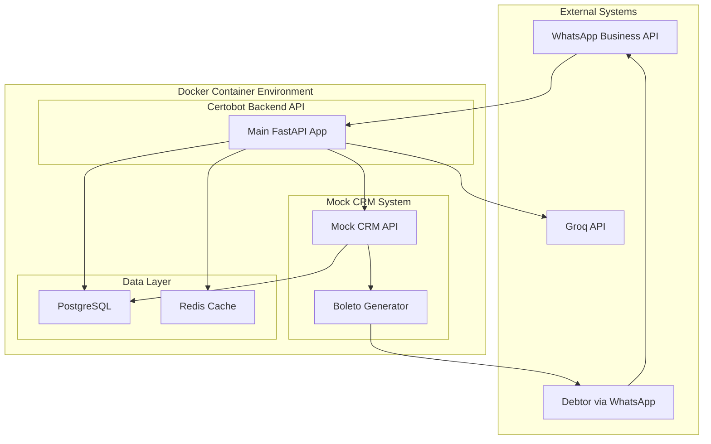

# Design Document

## Overview

Certobot is a containerized conversational AI system that automates debt collection through WhatsApp messaging for financial consulting firms. The system integrates natural language processing, identity validation, payment processing, and CRM connectivity to provide an empathetic, human-like debt negotiation experience exclusively in Brazilian Portuguese.

The architecture follows a simplified microservices pattern with REST API communication using Docker containers, ensuring easy deployment and development while maintaining good performance for local testing and small-scale production use. The system addresses the bottleneck of managing thousands of individual debtors by providing automated, empathetic conversations that can handle multiple simultaneous negotiations.

## Architecture

### High-Level Architecture



### Component Architecture

The system consists of two backend services:

### Main Certobot API (FastAPI Application)
1. **WhatsApp Module**: Handles WhatsApp Business API webhooks and message sending
2. **Negotiation Module**: Manages conversation flow using PydanticAI agents
3. **Validation Module**: Performs CPF validation and identity verification
4. **CRM Integration Module**: Communicates with CRM system via REST APIs for debtor data retrieval and result updates

### Mock CRM System (Separate FastAPI Service)
1. **Debtor Data API**: REST endpoints to provide debtor information (CPF, name, phone, debt details)
2. **Negotiation Results API**: REST endpoints to receive and store conversation outcomes
3. **Boleto Generation API**: REST endpoints to create and deliver payment slips when negotiations succeed
4. **Mock Data Management**: REST endpoints to manage test debtor database for MVP testing

**API Integration Flow:**
- Certobot → `GET /api/debtors/{cpf}` → Retrieve debtor information (CPF, name, phone, debt amount, due date) before initiating contact
- Certobot → WhatsApp API → Initiate conversation to debtor's registered phone number
- Certobot → `POST /api/negotiations/results` → Send qualitative negotiation outcome with timestamps
- Mock CRM → `POST /api/boletos/generate` → Create boleto for successful negotiations automatically
- Mock CRM → WhatsApp API → Send boleto with Portuguese instructions to debtor

**Pre-Contact Data Requirements:**
- System must access complete debtor information before conversation initiation
- Required data: CPF, name, phone number, total debt amount, due date
- Data retrieval enables personalized and informed conversations
- Supports validation process using stored CPF information

### Simplified Development Stack

**Technology Stack:**
- **Backend**: Python with FastAPI (single application)
- **AI Framework**: PydanticAI for structured AI agents and conversation management
- **Database**: PostgreSQL for persistent data storage
- **Cache**: Redis for session management and caching
- **AI Integration**: Groq API for fast, cost-effective language model inference
- **Containerization**: Docker and Docker Compose for local deployment

**Architecture Benefits:**
- **Simplified**: No complex message queues or reverse proxies
- **Fast Development**: Single codebase with modular structure
- **Cost Effective**: Groq API is significantly cheaper than OpenAI
- **Type Safe**: PydanticAI provides structured AI interactions with validation
- **Easy Debugging**: All components in one application for easier troubleshooting
- **API-First**: Clean separation between Certobot and CRM via REST APIs
- **Testable**: Mock CRM allows complete end-to-end testing without production dependencies

### Mock CRM API Specification (Mock_CRM_API)

**Design Rationale:** The Mock CRM API simulates a production CRM system to enable comprehensive MVP testing without external dependencies. It supports at least 100 mock debtor records and provides realistic data for validation testing, addressing Requirement 7.

**Debtor Management Endpoints:**
```
GET /api/debtors/{cpf}
- Returns debtor information with CPF, name, phone, debt amount, due date
- Response: DebtorInfo model with realistic Brazilian data
- Supports 100+ mock debtor records for comprehensive testing
- Returns appropriate HTTP status codes for different scenarios

POST /api/debtors
- Creates new debtor record for testing scenarios
- Request: DebtorInfo model with Brazilian Portuguese metadata
- Returns appropriate HTTP status codes and error messages

PUT /api/debtors/{cpf}
- Updates existing debtor record for testing
- Request: DebtorInfo model
- Supports CRUD operations as specified in requirements
```

**Negotiation Results Endpoints:**
```
POST /api/negotiations/results
- Receives qualitative conversation outcome from Certobot
- Request: ConversationOutcome model with Portuguese language metadata
- Stores successful/partially successful/unsuccessful outcomes with timestamps
- Triggers automatic boleto generation for successful negotiations
- Returns appropriate HTTP status codes and error messages for different scenarios

GET /api/negotiations/results/{session_id}
- Retrieves negotiation result by session ID
- Includes payment slip references, timestamps, and audit information
- Supports follow-up tracking as required
```

**Boleto Generation Endpoints:**
```
POST /api/boletos/generate
- Generates boleto for successful negotiations automatically
- Request: PaymentAgreement model with Brazilian currency formatting
- Response: Boleto URL and metadata in Portuguese
- Automatically sends boleto via WhatsApp to debtor
- Includes clear payment instructions and deadlines in Portuguese

GET /api/boletos/{boleto_id}
- Retrieves boleto details and status
- Returns Portuguese language documentation
- Links payment slip references to debtor records
```

**Testing Support Features:**
- Realistic CPF, name, phone, debt amount, and due date data for Brazilian context
- Support for various negotiation outcome scenarios (successful, partially successful, unsuccessful)
- Appropriate HTTP status codes and error message handling in Portuguese
- Comprehensive test data set with 100+ mock debtor records as specified
- Brazilian localization for all generated content and responses
- Simulates debtor data retrieval and conversation outcome storage as required

## Components and Interfaces

### WhatsApp Service

**Responsibilities:**
- Webhook handling for incoming WhatsApp messages
- Message sending via WhatsApp Business API with 5-second response time requirement
- Session management and conversation state tracking for simultaneous conversations
- Rate limiting and message queuing
- Automatic conversation initiation to debtor phone numbers

**Key Interfaces:**
```typescript
interface WhatsAppMessage {
  messageId: string;
  from: string;
  to: string;
  content: string;
  timestamp: Date;
  messageType: 'text' | 'document' | 'image';
  language: 'pt-BR'; // All messages in Brazilian Portuguese
}

interface ConversationSession {
  sessionId: string;
  debtorPhone: string;
  status: 'active' | 'completed' | 'failed' | 'abandoned';
  startTime: Date;
  lastActivity: Date;
  validationStatus: 'pending' | 'validated' | 'failed';
  validationAttempts: number; // Max 3 attempts
  conversationDuration: number; // Max 3 minutes
}
```

**Performance Requirements:**
- Response time: < 5 seconds for all debtor messages
- Concurrent conversations: Support multiple simultaneous sessions
- Session timeout: 3 minutes maximum per conversation

**External Dependencies:**
- WhatsApp Business API for message sending/receiving
- Redis for session storage and caching
- PostgreSQL for data persistence

### Negotiation Module

**Responsibilities:**
- Orchestrating conversation flow using PydanticAI agents
- Integration with Groq API for natural language processing in Brazilian Portuguese
- Implementing negotiation logic with empathetic responses for low-income clients
- Managing conversation context and history through structured agents
- Conducting open-ended conversations without restricting debtor responses
- Responding with empathy to financial hardship mentions
- Offering appropriate discounts based on predefined parameters

**Key Interfaces:**
```python
from pydantic import BaseModel
from pydantic_ai import Agent

class NegotiationContext(BaseModel):
    session_id: str
    debtor_info: DebtorInfo
    conversation_history: list[ConversationMessage]
    current_phase: Literal['validation', 'negotiation', 'agreement', 'completion']
    negotiation_parameters: NegotiationParams
    language: str = 'pt-BR'  # Brazilian Portuguese only
    tone: str = 'empathetic_informal'  # For low-income clients

class NegotiationParams(BaseModel):
    max_discount_percentage: float
    min_payment_amount: float
    max_installments: int
    empathy_level: Literal['high', 'medium', 'low'] = 'high'  # Default high empathy
    conversation_timeout: int = 180  # 3 minutes maximum

class DebtorInfo(BaseModel):
    cpf: str
    name: str
    phone: str
    debt_amount: float
    due_date: datetime
    days_past_due: int

# PydanticAI Agent Definition
negotiation_agent = Agent(
    'groq:llama-3.1-70b-versatile',
    deps_type=NegotiationContext,
    result_type=NegotiationResponse,
    system_prompt="Conduct empathetic debt negotiations in Brazilian Portuguese using informal tone appropriate for low-income clients. Understand colloquialisms and respond with compassion to financial hardship."
)
```

**Language and Cultural Requirements:**
- Exclusive use of Brazilian Portuguese for all interactions
- Understanding of Brazilian Portuguese colloquialisms and informal expressions
- Empathetic and informal tone appropriate for low-income clients
- Cultural sensitivity in debt collection conversations

**AI Integration:**
- Groq API with Llama models for fast, cost-effective conversation generation
- PydanticAI agents for structured conversation management and validation
- Custom prompt engineering for Brazilian Portuguese and empathetic responses
- Automatic context window management through PydanticAI
- Open-ended conversation capability without predefined response options

### Validation Service (Debtor_Validator)

**Responsibilities:**
- CPF format validation and digit verification using first three digits
- Identity confirmation through challenge-response in Portuguese
- Maximum 3 validation attempts per conversation session
- Conversation termination on validation failure
- Audit logging for compliance and security

**Key Interfaces:**
```typescript
interface CPFValidationRequest {
  sessionId: string;
  providedDigits: string; // First 3 digits only
  fullCPF: string; // From CRM system
  attemptNumber: number; // Max 3 attempts
  language: 'pt-BR';
}

interface ValidationResult {
  isValid: boolean;
  remainingAttempts: number;
  validationTimestamp: Date;
  shouldTerminate: boolean; // True if max attempts exceeded
  errorMessage?: string; // In Portuguese
}

interface ValidationPrompts {
  initial: string; // "Por favor, informe os três primeiros dígitos do seu CPF"
  retry: string; // "Os dígitos não conferem. Tente novamente"
  final_attempt: string; // "Última tentativa. Digite os três primeiros dígitos do seu CPF"
  failure: string; // "Não foi possível validar sua identidade. Conversa encerrada"
}
```

**Validation Flow:**
1. Request first three digits of CPF in Portuguese
2. Compare against stored CPF information from CRM
3. Allow maximum 3 attempts per session
4. Terminate conversation and log failed attempt if validation fails
5. Proceed to negotiation phase only after successful validation

**Security Features:**
- Failed attempt logging for fraud detection
- Session termination on validation failure
- Audit trail for compliance requirements

### Payment Service (Payment_Processor)

**Responsibilities:**
- Automatic invoice/payment slip generation upon agreement
- Document delivery via WhatsApp in Portuguese
- Payment terms capture (amount, due date, discounts)
- Brazilian currency formatting and Portuguese language documentation
- Clear payment instructions and deadlines in Portuguese

**Key Interfaces:**
```typescript
interface PaymentAgreement {
  sessionId: string;
  debtorCPF: string;
  debtorName: string;
  originalAmount: number;
  agreedAmount: number;
  discountApplied: number;
  installments: number;
  dueDate: Date;
  paymentMethod: 'boleto' | 'pix' | 'installments';
  agreementTimestamp: Date;
}

interface PaymentDocument {
  documentId: string;
  documentType: 'boleto' | 'pix';
  documentUrl: string;
  qrCode?: string;
  expirationDate: Date;
  instructions: string; // In Portuguese
  currency: 'BRL'; // Brazilian Real
  language: 'pt-BR';
}

interface PaymentInstructions {
  title: string; // "Instruções de Pagamento"
  deadline: string; // "Prazo de Vencimento"
  amount: string; // "Valor a Pagar"
  method: string; // "Forma de Pagamento"
  contact: string; // "Em caso de dúvidas"
}
```

**Automatic Processing Flow:**
1. Trigger automatic generation when payment agreement is reached
2. Capture all payment terms including discounts and due dates
3. Generate payment documentation with Brazilian formatting
4. Send documentation via WhatsApp with Portuguese instructions
5. Include clear payment deadlines and contact information

**Localization Features:**
- All documentation in Brazilian Portuguese
- Brazilian Real (BRL) currency formatting
- Local payment method support (boleto bancário, PIX)
- Cultural appropriate payment instructions and deadlines

### CRM Integration Module (CRM_Connector)

**Responsibilities:**
- API communication with CRM systems for debtor data retrieval (CPF, name, phone, debt amount, due date)
- Qualitative conversation outcome recording with timestamps
- Payment agreement capture and payment slip reference linking
- HTTP client management and error handling
- API authentication and rate limiting

**Key Interfaces:**
```python
from pydantic import BaseModel
from datetime import datetime
from typing import Literal

class DebtorInfo(BaseModel):
    cpf: str
    name: str
    phone: str
    debt_amount: float
    due_date: datetime
    days_past_due: int
    previous_contacts: list[ContactHistory] = []

class ConversationOutcome(BaseModel):
    session_id: str
    debtor_cpf: str
    outcome: Literal['successful', 'partially_successful', 'unsuccessful', 'no_contact']
    agreed_amount: float | None = None
    discount_amount: float | None = None
    payment_date: datetime | None = None
    scheduled_payment_dates: list[datetime] = []  # For installments
    payment_slip_reference: str | None = None
    qualitative_notes: str  # Detailed outcome description
    interaction_timestamp: datetime
    duration: int
    language: str = 'pt-BR'

class PaymentSlipLink(BaseModel):
    debtor_cpf: str
    payment_slip_id: str
    payment_slip_url: str
    linked_timestamp: datetime
    agreement_reference: str

class CRMClient:
    async def get_debtor_info(self, cpf: str) -> DebtorInfo
    async def submit_negotiation_result(self, outcome: ConversationOutcome) -> bool
    async def link_payment_slip(self, link: PaymentSlipLink) -> bool
    async def update_debtor_contact_log(self, cpf: str, interaction: ContactHistory) -> bool
```

**Outcome Recording Requirements:**
- Record successful, partially successful, or unsuccessful negotiations
- Capture payment agreements with discount amounts and scheduled dates
- Link payment documentation references to debtor records
- Timestamp all interactions for audit and follow-up purposes
- Store qualitative information about contact outcomes
- Maintain Portuguese language metadata for all interactions

**Data Integration Flow:**
1. Retrieve debtor information before conversation initiation
2. Access CPF, name, phone number, total debt amount, and due date
3. Update CRM with conversation outcomes upon completion
4. Link generated payment slips to debtor records
5. Maintain audit trail with timestamps for compliance

## Data Models

### Core Entities

```typescript
// Debtor Entity
interface Debtor {
  id: string;
  cpf: string;
  name: string;
  phone: string;
  email?: string;
  address?: Address;
  createdAt: Date;
  updatedAt: Date;
}

// Debt Entity
interface Debt {
  id: string;
  debtorId: string;
  originalAmount: number;
  currentAmount: number;
  dueDate: Date;
  daysPastDue: number;
  debtType: string;
  status: 'active' | 'negotiating' | 'paid' | 'written_off';
  createdAt: Date;
}

// Conversation Entity
interface Conversation {
  id: string;
  sessionId: string;
  debtorId: string;
  debtId: string;
  startTime: Date;
  endTime?: Date;
  status: 'active' | 'completed' | 'failed' | 'abandoned';
  messages: ConversationMessage[];
  outcome?: ConversationOutcome;
}

// Message Entity
interface ConversationMessage {
  id: string;
  conversationId: string;
  sender: 'system' | 'debtor';
  content: string;
  timestamp: Date;
  messageType: 'text' | 'document' | 'validation_request';
  metadata?: Record<string, any>;
}
```

### Database Schema Design

**PostgreSQL Tables:**

1. **debtors**: Primary debtor information with CPF indexing
2. **debts**: Debt records linked to debtors
3. **conversations**: Conversation sessions with status tracking
4. **messages**: Individual messages within conversations
5. **outcomes**: Negotiation results and payment agreements

## Error Handling

### Error Categories and Responses

1. **WhatsApp API Errors**
   - Rate limiting: Implement exponential backoff
   - Message delivery failures: Retry with different message formats
   - Webhook validation errors: Log and alert for manual intervention

2. **AI Service Errors**
   - Groq API timeouts: Fallback to predefined responses
   - Context window exceeded: PydanticAI automatic context management
   - Content filtering: Graceful degradation with human-like responses
   - API rate limits: Implement request queuing and retry logic
   - Model validation errors: PydanticAI automatic retry with structured output

3. **Validation Errors**
   - Invalid CPF format: Provide clear guidance in Portuguese
   - Exceeded validation attempts: Escalate to human operator
   - System unavailable: Queue for later processing

4. **Payment Processing Errors**
   - Document generation failures: Retry with simplified templates
   - Integration timeouts: Store agreement for manual processing
   - Invalid payment data: Request clarification from debtor

### Error Response Strategy

```typescript
interface ErrorResponse {
  errorCode: string;
  userMessage: string; // Always in Portuguese
  technicalMessage: string;
  retryable: boolean;
  escalationRequired: boolean;
}

// Example error responses in Portuguese
const ERROR_MESSAGES = {
  CPF_INVALID: "Desculpe, os dígitos do CPF não conferem. Você pode tentar novamente?",
  SYSTEM_BUSY: "Nosso sistema está um pouco ocupado agora. Posso tentar novamente em alguns minutos?",
  PAYMENT_ERROR: "Houve um problema ao gerar seu boleto. Vou resolver isso para você em instantes."
};
```

## Testing Strategy

### Unit Testing
- **Coverage Target**: 90% code coverage for all services
- **Framework**: Jest with TypeScript support
- **Focus Areas**: Business logic, validation rules, error handling
- **Mock Strategy**: Mock external dependencies (WhatsApp API, Azure services)

### Integration Testing
- **API Testing**: Test service-to-service communication
- **Database Testing**: Validate data persistence and retrieval
- **Message Queue Testing**: Verify event-driven communication
- **External Service Testing**: Test with WhatsApp Business API sandbox

### End-to-End Testing
- **Conversation Flow Testing**: Complete negotiation scenarios
- **Multi-language Testing**: Validate Portuguese language processing
- **Performance Testing**: Load testing with concurrent conversations
- **Failure Recovery Testing**: Test system resilience and recovery

### Testing Environment Setup
```yaml
# Docker Compose Test Environment
version: '3.8'
services:
  test_postgres:
    image: postgres:15
    environment:
      POSTGRES_DB: certobot_test
  test_redis:
    image: redis:7-alpine
  mock_whatsapp:
    build: ./test/mock-whatsapp
  mock_crm:
    build: ./mock-crm
    environment:
      - MOCK_DEBTORS_COUNT=100
      - LANGUAGE=pt-BR
    
test_data:
  mock_debtors: 100  # Minimum required by Requirement 7
  conversation_scenarios: 20
  cpf_test_cases: 50
  validation_scenarios: 15  # Including 3-attempt limit testing
  portuguese_language_tests: 30
  payment_document_tests: 10
```

**Mock CRM Testing Requirements:**
- 100+ mock debtor records with realistic Brazilian data
- CPF validation test scenarios (valid/invalid first 3 digits)
- Portuguese language conversation outcomes
- Payment slip generation and delivery testing
- HTTP status code and error message validation

### Performance Testing Targets
- **Response Time**: < 5 seconds for all debtor message responses (Requirement 1.3)
- **Conversation Duration**: Maximum 3 minutes per session (Requirement 3.5)
- **Concurrent Sessions**: Support multiple simultaneous conversations (Requirement 1.5)
- **Validation Attempts**: Maximum 3 CPF validation attempts per session (Requirement 2.4)
- **Throughput**: 1000 concurrent conversations
- **Availability**: 99.9% uptime
- **Scalability**: Auto-scaling based on message volume

**Language Processing Performance:**
- Brazilian Portuguese response generation < 3 seconds
- Colloquialism understanding and empathetic response capability
- Cultural context processing for low-income client interactions

### Security Testing
- **Data Privacy**: Validate CPF and personal data encryption
- **API Security**: Test authentication and authorization
- **Input Validation**: Prevent injection attacks
- **Compliance**: LGPD (Brazilian data protection law) compliance validation